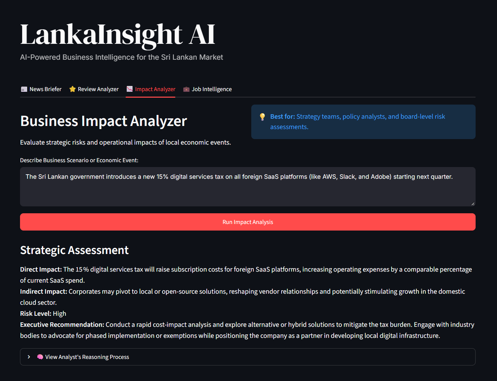
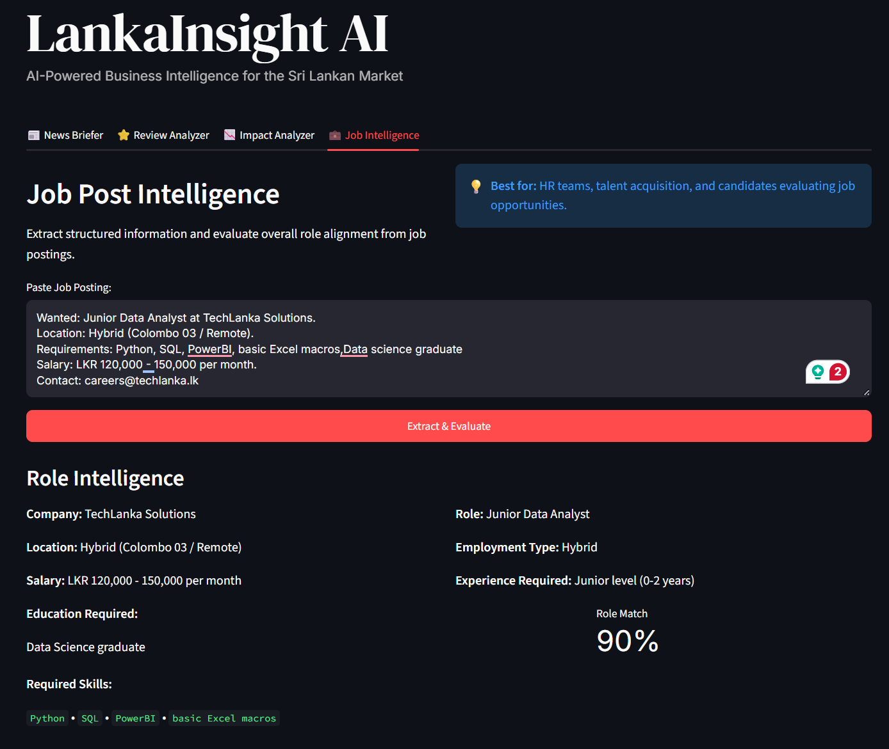

# 📊 LankaInsight: AI-Powered Business Intelligence

**LankaInsight** is a practical, product-first business intelligence tool designed for the Sri Lankan market. It transforms unstructured local business data—such as economic news, customer reviews, and job postings—into actionable, structured insights in seconds.

🔗 **Live Demo:** https://lankainsight-ai.streamlit.app

---

## 📸 App Previews

| 📰 Economic News Briefer | ⭐ Customer Review Analyzer |
| :---: | :---: |
|  |  |

| 📉 Business Impact Analyzer | 💼 Job Post Intelligence |
| :---: | :---: |
|  |  |

---

## 🎓 Learning & Foundations

This application is built upon industry best practices learned through two specialized DeepLearning.AI & OpenAI courses:
*   **[ChatGPT Prompt Engineering for Developers](https://www.deeplearning.ai/short-courses/chatgpt-prompt-engineering-for-developers/)**: Mastered core principles including delimiter usage, few-shot prompting, and enforcing structured JSON outputs for reliable software integration.
*   **[Building Systems with the ChatGPT API](https://www.deeplearning.ai/short-courses/building-systems-with-chatgpt/)**: Implemented advanced production techniques such as Chain-of-Thought (CoT) reasoning, inner monologue parsing, and iterative prompt evaluation to minimize hallucinations and ensure robust edge-case handling.

---

## 🚀 Features

*   **📰 Economic News Briefer:** Synthesizes raw economic updates into concise, executive-ready summaries tailored for C-suite decision-makers.
*   **⭐ Customer Review Analyzer:** Instantly categorizes, scores, and generates actionable remediation plans for customer feedback across local industries (Banking, Retail, Ride-hailing).
*   **📉 Business Impact Analyzer:** Evaluates strategic risks and operational impacts of local economic events, providing direct/indirect impact assessments and risk levels.
*   **💼 Job Post Intelligence:** Extracts structured data from job descriptions and evaluates role alignment against standard Data Science profiles.

## 🧠 Under the Hood: Prompt Engineering Architecture

While the UI is designed to be intuitive for non-technical business users, the backend leverages advanced Large Language Model (LLM) architectures and prompt engineering patterns to ensure high accuracy and reliability:

1.  **Zero-Shot Generation & Delimiters:** Used in the News Briefer to synthesize complex economic data without prior examples, utilizing strict delimiters (`"""`) to prevent prompt injection and separate instructions from context.
2.  **Few-Shot Classification:** Powers the Review Analyzer by providing the model with contextual `Input → Output` examples. This ensures strict adherence to local business categories and sentiment scoring without the need for fine-tuning.
3.  **Chain-of-Thought (CoT) Reasoning:** The Impact Analyzer forces the model to reason step-by-step internally (using Markdown headers for reasoning vs. final output). This significantly reduces hallucinations in complex strategic scenarios.
4.  **Structured Output Parsing:** The Job Intelligence feature enforces strict JSON schemas. A robust regex-based parser extracts the JSON payload, allowing seamless integration with downstream HR databases.

*Note: Temperature, top-p, and max_tokens are dynamically tuned per feature (e.g., `temperature=0.0` for strict JSON extraction, `temperature=0.5` for strategic reasoning).*

## 📁 Project Structure

*   `app.py` - The main production-ready Streamlit application with custom CSS styling.
*   `lankainsight_exploration.ipynb` - The Jupyter Notebook used for iterative prompt testing, parameter tuning, and debugging before UI integration.
*   `ScreenShots/` - UI previews for the README.
*   `requirements.txt` - Python dependencies.
*   `.env` - Local environment variables (API keys).

## 🛠️ Tech Stack

*   **Backend / AI:** Python, Groq API (`openai/gpt-oss-20b`), `groq` SDK
*   **Frontend / UI:** Streamlit (Custom CSS)
*   **Environment:** `python-dotenv` for local secret management

## 🔄 Iterative Development & Lessons Learned

This project was built following the iterative prompt development lifecycle: `Idea → Write → Run → Evaluate → Improve → Repeat`. 

Key engineering challenges solved during development:
*   **Empty Response Handling:** Resolved issues where strict "output only JSON" constraints caused the model to return empty strings by implementing a robust regex parser that isolates JSON objects from conversational filler.
*   **Fallback Parsing:** Implemented fallback logic in the Impact Analyzer to handle cases where the model ignores formatting tags, ensuring the app never crashes on UI generation.
*   **Token Management:** Dynamically adjusted `max_tokens` per feature to prevent output truncation during complex reasoning tasks while keeping latency low for simple classifications.

## 💻 How to Run Locally

1. Clone the repository:
   ```bash
   git clone https://github.com/your-username/LankaInsight-AI.git
   cd LankaInsight-AI
   ```
2. Create and activate a virtual environment:
   ```bash
   python -m venv venv
   source venv/bin/activate  # On Windows: venv\Scripts\activate
   ```
3. Install dependencies:
   ```bash
   pip install -r requirements.txt
   ```
4. Set up your environment variables:
   Create a `.env` file in the root directory and add your Groq API key:
   ```env
   GROQ_API_KEY=your_groq_api_key_here
   ```
5. Run the Streamlit app:
   ```bash
   streamlit run app.py
   ```

---
*Built by Visura Rodrigo*